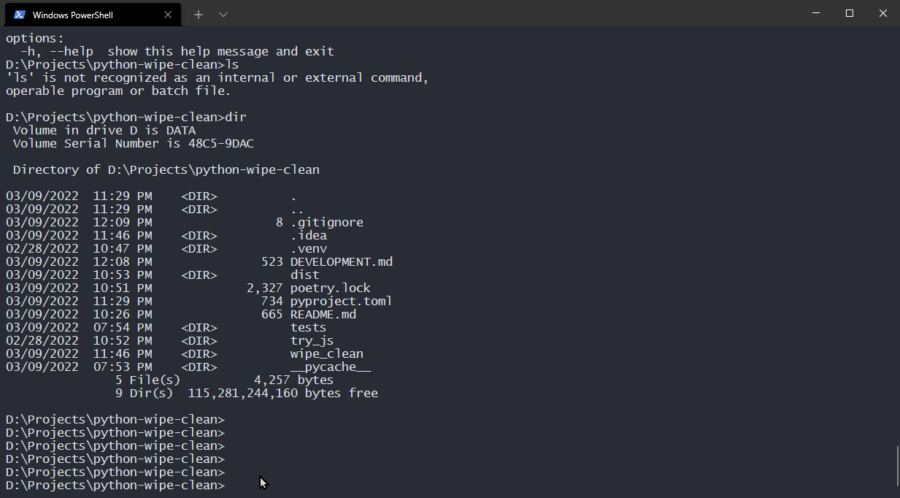

# Wipe Clean


Clean your terminal in a ritual way. Works on Windows, Linux and macOS.




```bash
pip install wipe-clean
```

> `wipe-clean` requires Python 3.6.1 and above. Note that Python 3.6.0 is
 not supported due to lack of `NamedTuples` typing.


## Usage

```bash
wipe-clean
```


## Related Projects

- [`JeanJouliaCode/wipeclean`](https://github.com/JeanJouliaCode/wipeClean) (JavaScript)

  The animation part is a direct port of `JeanJouliaCode/wipeclean`.
